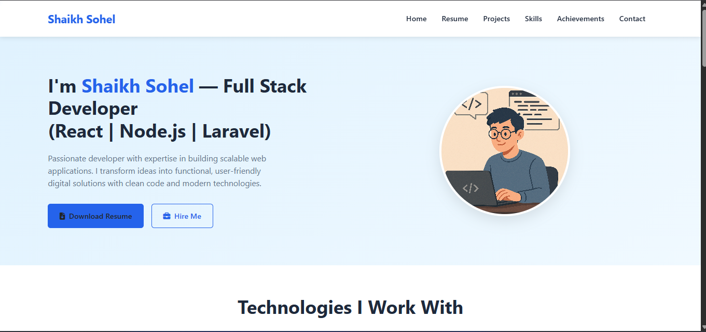
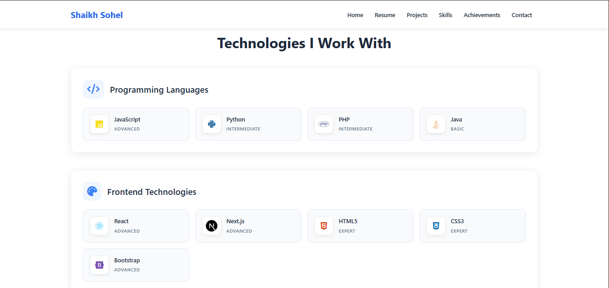
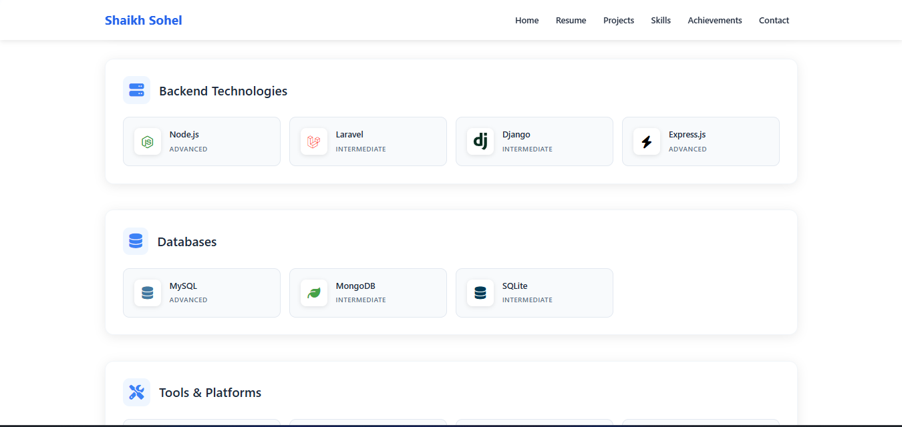
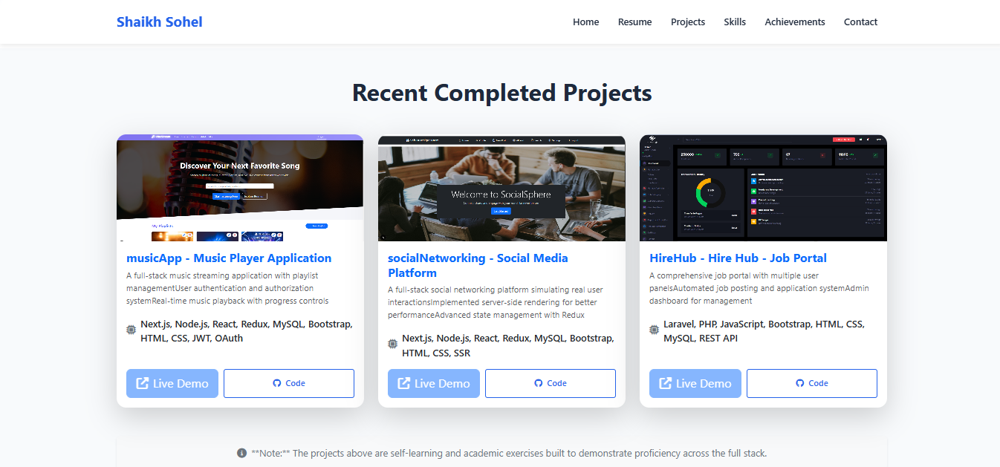
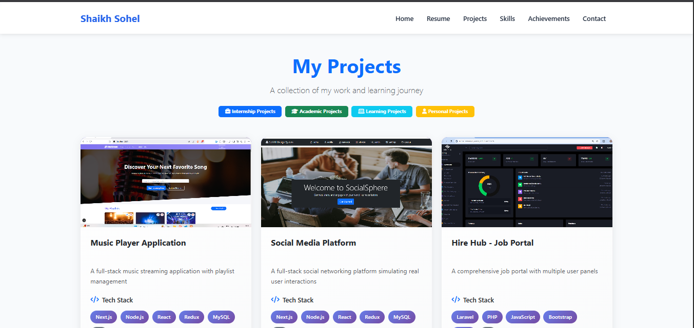

<h2>Portfolio Website</h2>

<div align="center">    </div>

<br />
<h3>🚀 About the Project</h3>
<br />
A modern, responsive portfolio website built with React.js and Bootstrap to showcase my skills, projects, and professional experience. This single-page application features smooth animations, a clean design, and optimal performance across all devices.
<br />

<h3>Built With</h3>
<br />
<ul>
    <li><b>React.js</b> - A JavaScript library for building user interfaces</li>
    <li><b>JavaScript (ES6+)</b> - Programming language for interactive features</li>
    <li><b>Bootstrap 5</b> - CSS framework for responsive design</li>
    <li><b>React Bootstrap</b> - Bootstrap components for React</li>
    <li><b>CSS3</b> - Custom styling and animations</li>
</ul>
<br />
<h3>📁 Project Directory</h3>
<br />

```bash
portfolio-website/
├── public/
│   ├── index.html
│   ├── favicon.ico
│   └── manifest.json
├── src/
│   ├── components/
│   │   ├── Header/
│   │   ├── About/
│   │   ├── Skills/
│   │   ├── Projects/
│   │   ├── Contact/
│   │   └── Footer/
│   ├── assets/
│   │   ├── images/
│   │   └── styles/
│   ├── App.js
│   ├── App.css
│   └── index.js
├── package.json
└── README.md

```
<br />
<h3>⚙️ Installation & Setup</h3>
<br />
<p>Follow these steps to run this project locally:</p>
<br />
```bash
Prerequisites
Make sure you have the following installed:
Node.js (version 14 or higher)
npm (comes with Node.js)
```

<h4>Installation Steps</h4>
<h6>1.Clone the repository</h6>
```bash
    git clone https://github.com/Sohailshaikh5656/my-portfolio.git
```
<h6>2.Navigate to the project directory</h6>
```bash
    cd my-portfolio
```
<h6>3.Install dependencies</h6>
```bash
   npm install
```
<h6>4.Start the development server</h6>
```bash
   npm start
```
<h6>5.Open your browser</h6>
```bash
   #The application will automatically open in your default browser at http://localhost:3000
```

<br />
<br />

<h4>✨ Features</h4>
<br />
<br />
<ul>
    <li><b>Responsive Design</b> - Optimized for all devices (mobile, tablet, desktop)</li>
    <li><b>Modern UI/UX</b> - Clean and professional interface with smooth animations</li>
    <li><b>Project Showcase</b> - Display projects with descriptions and links</li>
    <li><b>Skills Section</b> - Visual representation of technical skills</li>
    <li><b>Contact Form</b> - Functional contact form with validation</li>
</ul>
<h4>📸 Screenshots</h4>
<br />
<div align="center">
    
    
    
    
    
</div>
<br />

<h4>📄 License</h4>
<br />
This project is licensed under the MIT License - see the LICENSE.md file for details.